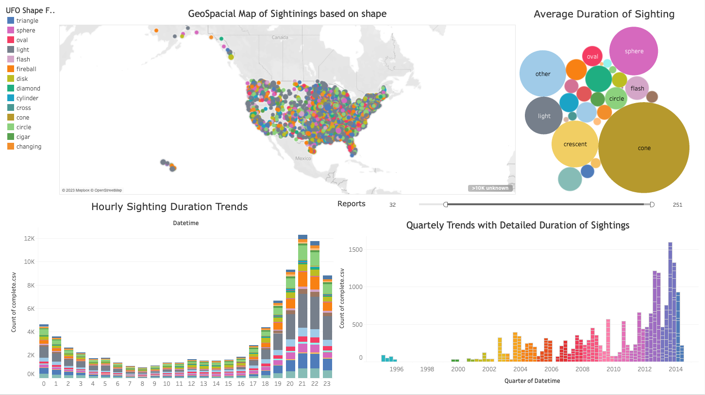

# 🚀 UFO Sightings Analytics Dashboard 🌌

### 📊 **Interactive Tableau Dashboard for UFO Sightings Analysis**  

This project presents an **interactive UFO Sightings Dashboard**, developed using **Tableau**, to analyze over **88,000 UFO sightings** reported across the United States over the last century. The dataset, sourced from the **National UFO Reporting Center (NUFORC)**, provides a wealth of information on UFO encounters, including **when**, **where**, and **how** they occurred, along with descriptions of their shapes and durations.  

With the increasing interest in **extraterrestrial phenomena, government disclosures, and scientific inquiries into UAPs (Unidentified Aerial Phenomena)**, this dashboard provides a **data-driven exploration of UFO reports**, helping to uncover **patterns, correlations, and anomalies** in sighting trends.  

  

### 🔎 **What This Dashboard Reveals:**  
🔹 **Trends Over Time:** UFO sightings surged in the late 20th century, reaching their peak in the early 2010s before slightly declining in recent years.  
🔹 **Geographical Hotspots:** Certain states—**California, Florida, and Washington—report significantly more UFO sightings** than others, while sparsely populated areas report fewer cases.  
🔹 **Commonly Reported Shapes:** The vast majority of sightings are of **"lights" or glowing orbs**, with **disks, circles, and triangles** making up a smaller but notable portion.  
🔹 **Peak Sighting Times:** The most common time for sightings is **between 8 PM and 11 PM**, with a **sharp peak around 9–10 PM**, reinforcing the theory that low-light conditions play a key role in observations.

### 📌 **Key Insights from the Dashboard**  

### 1️⃣ **📈 Trends in UFO Sightings Over Time**  
  

- **Surge in Sightings**: Reports of UFOs were rare before the 1950s but skyrocketed in the late 20th century.  
- **Peak Sightings**: The early 2000s witnessed a massive increase in UFO reports, suggesting growing public interest or increased sky monitoring.  
- **Recent Decline**: Reports slightly declined after 2014, possibly due to reporting fatigue or better explanations for aerial phenomena.  

---

### 2️⃣ **🛸 UFO Shape Distribution**  
  

- **Most Commonly Reported Shape**: The **"light"** category dominates UFO reports, accounting for tens of thousands of sightings.  
- **Classic "Flying Saucers"**: Circular and disk-shaped UFOs are frequent but outnumbered by light-based sightings.  
- **Rare Shapes**: Exotic shapes like "crescents," "hexagons," and "crosses" are barely reported, suggesting that most sightings fall into familiar forms.  

---

### 3️⃣ **📍 Geographical Hotspots of Sightings**  
  

- **California is the UFO Capital**: With over 11,000 reports, California leads in UFO sightings, possibly due to its large population and aerospace industry.  
- **Other Hotspots**: Florida, Washington, and Arizona also show high numbers of reports, hinting at cultural, geographic, or observational factors.  
- **Sparse Sightings in the Midwest**: Less populated states report fewer UFOs, likely due to lower observer density rather than fewer UFOs themselves.  

---

### 4️⃣ **⏳ When Do UFO Sightings Happen? (Time of Day)**  
  

- **Peak Viewing Hours**: Most UFO sightings occur between **8 PM and 11 PM**, with the highest activity around **9–10 PM**.  
- **Dips During Daylight**: Sightings drop significantly from early morning to noon, likely due to high visibility making lights harder to mistake for UFOs.  
- **Evening Observations Matter**: The trend suggests that darkness plays a significant role in how and when people notice aerial anomalies.  

---

## 📂 **Project Structure**  

- **📊 Tableau Dashboard Files/** → Contains the Tableau workbook used to generate the dashboard.  
- **📂 images/** → Stores visualizations extracted from the Tableau dashboard for documentation.  
- **📂 data/** → Contains the dataset used for analysis, including a cleaned version.  
- **📂 reports/** → Research and analysis documents summarizing findings.  

---

## 🛠 **How to Use This Dashboard**  
1. **Clone the Repository**  
   ```bash
   git clone https://github.com/yourusername/UFO-Sightings-Analytics-Dashboard.git
   cd UFO-Sightings-Analytics-Dashboard
